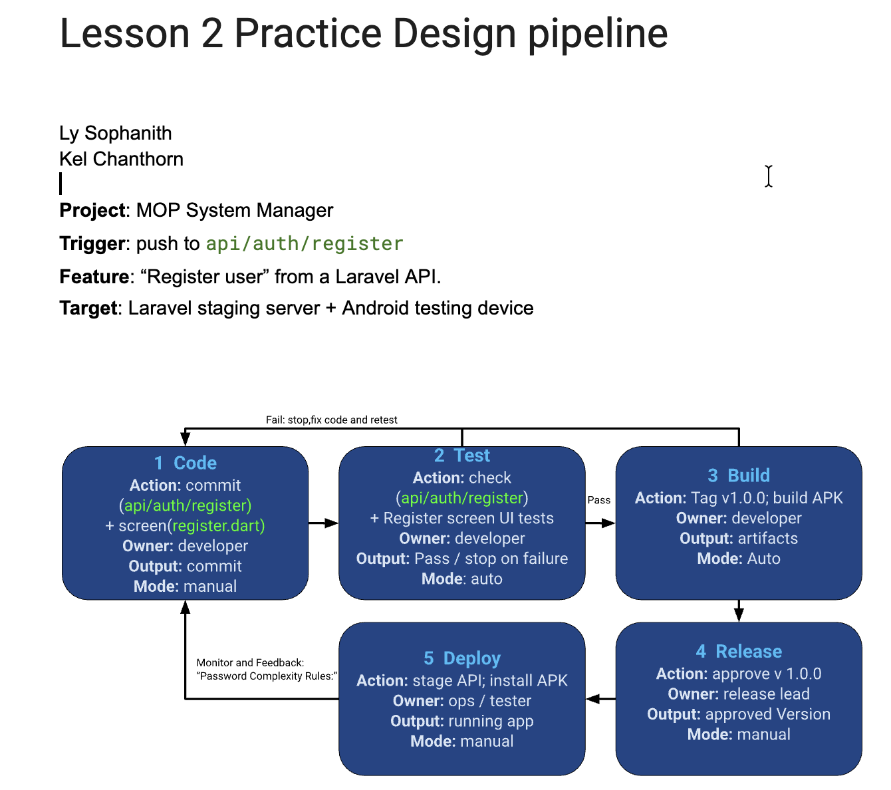

# DevOps Conception Class
- Student: [Ly Sophanith]

## Lesson 2: My CI/CD pipeline
- Project: [Flutter app + Laravel API]
- Trigger: [push to api/auth/register]
- Target: [Laravel staging server + Android testing device]

### Pipeline design
Code -> Test -> Build -> Release -> Deploy
1. Code: [commit (api/auth/register) + screen(register.dart)] | [developer] | [commit] | [manual]
2. Test: [check (api/auth/register) + Register screen UI tests] | [developer] | [Pass / stop on failure] | [auto]
3. Build: [Tag v1.0.0; build APK] | [developer] | [artifacts] | [auto]
4. Release: [approve v 1.0.0] | [release lead] | [approved Version] | [manual]
5. Deploy: [stage API; install APK] | [ops / tester] | [running app] | [manual]
### Controls
On test/build failure: ... | Release approval by: ...
After deployment, check: ... | If it fails: ...
Feedback for the next change: ...
Optional drawing: 
